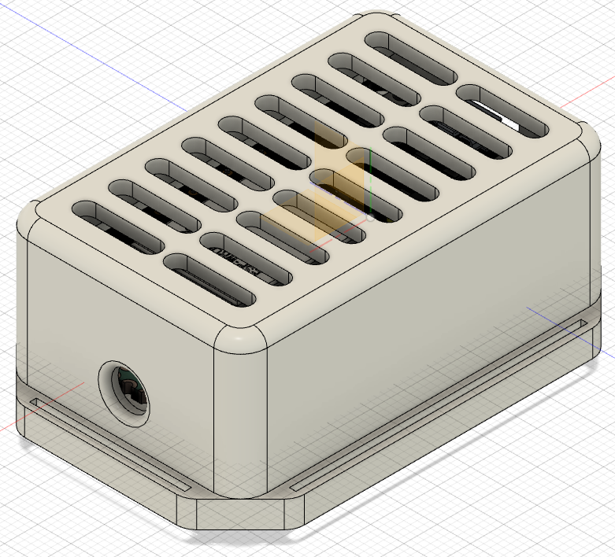
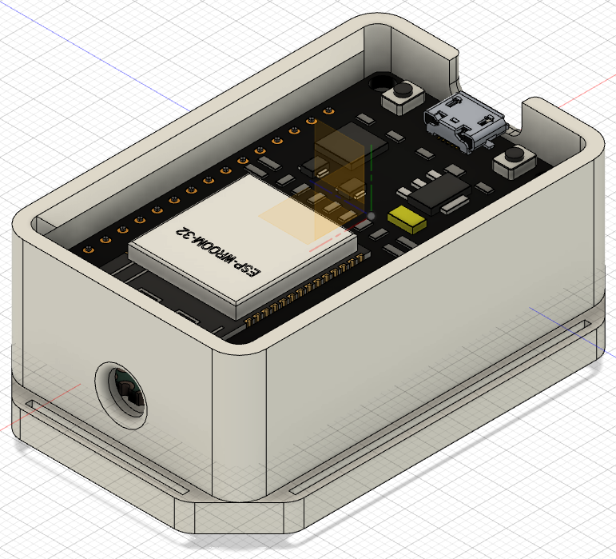
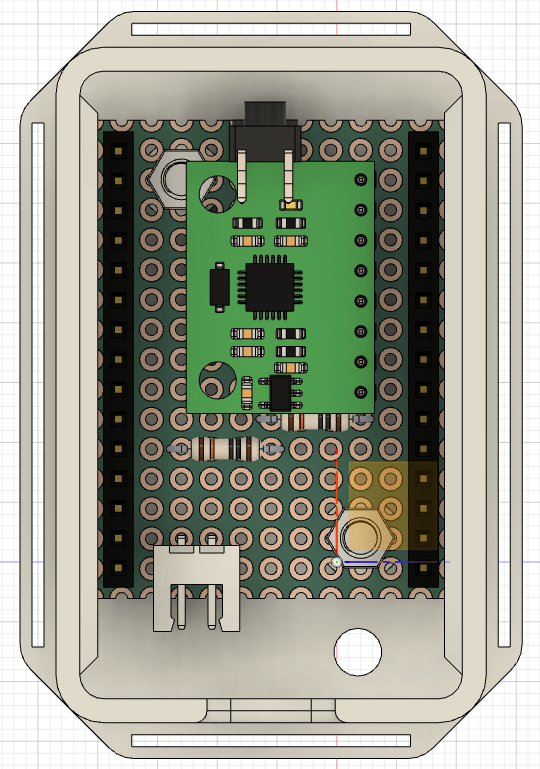

# esp32 motion capture
A low-cost IMU device based on esp32 microcontroller that can be built using off-the-shelf components and 3D printing technology. A demo of it working can be seen [here](https://youtu.be/l2tk1jYufGg) and [here](https://youtu.be/TXH_NY6WH8g).

